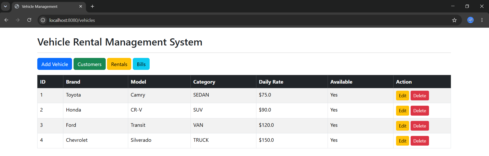
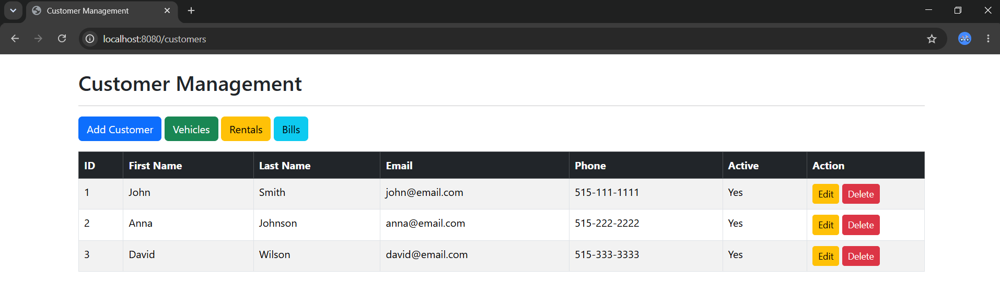
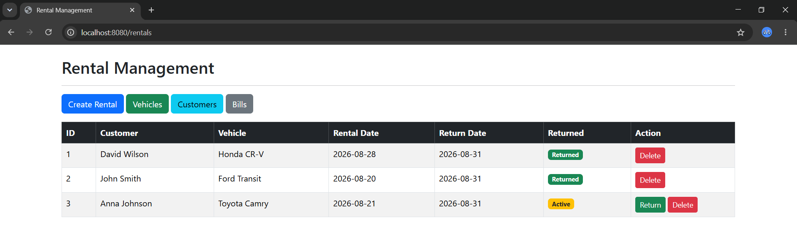
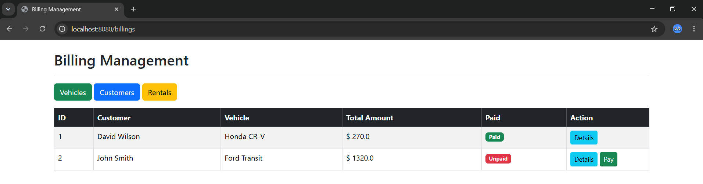
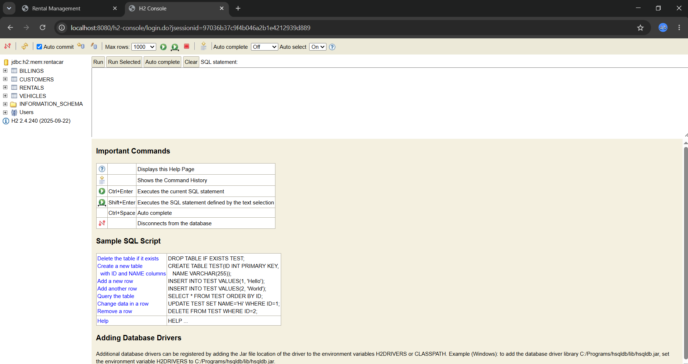

# Vehicle Rental Management System

## CS425 – Software Engineering Project

**Student:** A H M Golam Hafiz  
**Course:** CS425 – Software Engineering  
**Technology:** Spring Boot 3.3.4, Java 17

---

# Project Overview

The Vehicle Rental Management System is a web-based application developed using Spring Boot following a layered architecture. The system enables rental companies to manage vehicles, customers, rentals, and billing through an easy-to-use web interface.

The project demonstrates the use of Spring Boot, Spring MVC, Spring Data JPA, Thymeleaf, H2 Database, and Maven while following software engineering principles.

---

# Problem Statement

Many small vehicle rental businesses still manage rentals manually using spreadsheets or paper-based records. This process is time-consuming, error-prone, and difficult to maintain.

The Vehicle Rental Management System automates the rental process by providing a centralized system for managing vehicles, customers, rentals, and billing.

---

# Project Purpose

The purpose of this project is to develop a simple vehicle rental management application that allows users to:

- Manage vehicle information
- Manage customer information
- Rent available vehicles
- Return rented vehicles
- Automatically generate rental bills

---

# Project Scope

The application includes the following modules:

- Vehicle Management
- Customer Management
- Rental Management
- Billing Management

---

# Stakeholders

- Rental Company Administrator
- Rental Staff
- Customers

---

# Features

## Vehicle Management

- Add Vehicle
- View Vehicle List
- Update Vehicle
- Delete Vehicle

## Customer Management

- Add Customer
- View Customer List
- Update Customer
- Delete Customer

## Rental Management

- Create Rental
- Return Vehicle
- Prevent renting unavailable vehicles

## Billing Management

- Automatically generate bill after vehicle return
- View Billing List
- Mark bill as paid

---

# Functional Requirements

The system shall:

- Allow users to create vehicles.
- Allow users to manage customers.
- Allow users to rent available vehicles.
- Allow users to return rented vehicles.
- Automatically generate rental bills.
- Store all information in the H2 database.

---

# Non-functional Requirements

- User-friendly interface
- Fast response time
- Simple layered architecture
- Data persistence using Spring Data JPA
- Easy maintenance
- Portable and lightweight

---

# Assumptions

- Only one administrator uses the system.
- Vehicle availability is maintained automatically.
- Billing is generated only after a vehicle is returned.

---

# Constraints

- Uses H2 in-memory database.
- No authentication or authorization.
- No online payment integration.
- Single-user demonstration application.

---

# Vision

To provide a simple and efficient vehicle rental management system that automates vehicle rentals, customer management, and billing while demonstrating software engineering concepts.

---

# System Architecture

The project follows a layered architecture.

```
Presentation Layer
        │
        ▼
Controller Layer
        │
        ▼
Service Layer
        │
        ▼
Repository Layer
        │
        ▼
H2 Database
```

---

# Project Structure

```
src
├── controller
├── service
├── repository
├── entity
├── resources
│   ├── templates
│   ├── static
│   └── application.properties
└── test
```

---

# Technologies Used

- Java 17
- Spring Boot 3.3.4
- Spring MVC
- Spring Data JPA
- Thymeleaf
- H2 Database
- Maven
- Lombok
- Bootstrap 5

---

# Database Tables

The application contains the following tables:

- Vehicles
- Customers
- Rentals
- Billings

---

# Main Use Cases

1. Manage Vehicles
2. Manage Customers
3. Rent Vehicle
4. Return Vehicle
5. Generate Bill
6. View Billing History

---

# Installation

## Clone Repository

```bash
git clone https://github.com/yourusername/vehicle-rental-management-system.git
```

## Open Project

Open the project using IntelliJ IDEA.

## Run

Execute:

```
VehicleRentalManagementApplication.java
```

The application starts at:

```
http://localhost:8080
```

---

# H2 Database

H2 Console:

```
http://localhost:8080/h2-console
```

Datasource:

```
jdbc:h2:mem:rentacar
```

Username

```
sa
```

Password

```

```

---

# Testing

The following functionality has been tested successfully.

- Add Vehicle
- Update Vehicle
- Delete Vehicle
- Add Customer
- Update Customer
- Delete Customer
- Create Rental
- Return Rental
- Generate Bill
- Mark Bill as Paid

---

# Screenshots

## Home / Vehicle List



---

## Customer Management



---

## Rental Management



---

## Billing Management



---

## H2 Database



---

# Known Limitations

- No login system
- No payment gateway integration
- No report generation
- No email notification
- Uses H2 database only

---

# Future Improvements

- Spring Security authentication
- MySQL/PostgreSQL support
- Online payment integration
- Reservation system
- Vehicle search and filtering
- Customer dashboard
- REST API
- Cloud deployment

---

# Conclusion

The Vehicle Rental Management System successfully demonstrates software engineering concepts by implementing a layered Spring Boot application for managing vehicles, customers, rentals, and billing. The project follows MVC architecture and uses Spring Data JPA for persistence, providing a simple, maintainable, and functional rental management solution.
